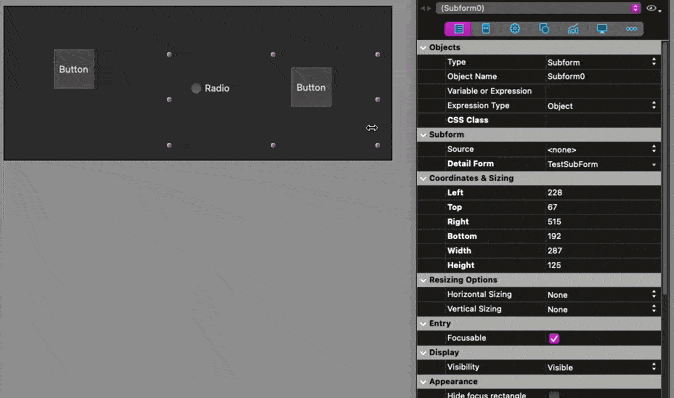

# Extract From or To Subform Form Macro

[![language][code-shield]][code-url]
[![language-top][code-top]][code-url]
![code-size][code-size]
[![license][license-shield]][license-url]
[![discord][discord-shield]][discord-url]

## Copy to new subform

Select objects in your form and launch the macro. Fill the name and voila, a new subform created.

You need to "restart interpreted" or reopen the base to load the new subform

## Replace by subform content

Select a subform and launch the macro.

All first page objects from subform will be copyed to your current form, and the subfrom link will be removed.

## TODO

- manage group, page etc
- find a way to reload forms:  ask to restart? (because bnew subform are not displayed without restart)
 

## Other components

<!-- MARKDOWN LINKS & IMAGES -->
<!-- https://www.markdownguide.org/basic-syntax/#reference-style-links -->
[code-shield]: https://img.shields.io/static/v1?label=language&message=4d&color=blue
[code-top]: https://img.shields.io/github/languages/top/mesopelagique/ExtractToSubformFormMacro.svg
[code-size]: https://img.shields.io/github/languages/code-size/mesopelagique/ExtractToSubformFormMacro.svg
[code-url]: https://developer.4d.com/
[license-shield]: https://img.shields.io/github/license/mesopelagique/ExtractToSubformFormMacro
[license-url]: LICENSE.md
[discord-shield]: https://img.shields.io/badge/chat-discord-7289DA?logo=discord&style=flat
[discord-url]: https://discord.gg/dVTqZHr
